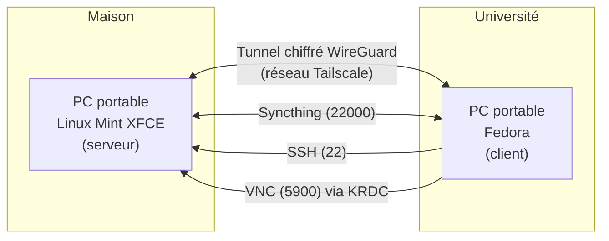

# Accès distant et synchronisation entre deux PC portables Linux

Mise en place d'un réseau privé entre mon PC portable resté à la maison et celui que j'emmène à l'université, pour accéder à distance à mes fichiers et à mon bureau, sans ouvrir aucun port sur ma box internet.

**Technologies :** Linux (Mint XFCE, Fedora) · Tailscale · SSH · x11vnc / KRDC (VNC) · Syncthing

---

## 🎯 Objectifs

- Accéder en ligne de commande à la machine de la maison depuis l'université (SSH)
- Afficher son bureau graphique à distance (VNC)
- Synchroniser automatiquement mes dossiers de photos entre les deux machines
- Le faire **sans redirection de ports** sur la box

## 🏗️ Architecture



| Machine | Système | Rôle | Outils |
|---|---|---|---|
| `machine-a` (maison) | Linux Mint XFCE | Serveur | OpenSSH, x11vnc, Syncthing |
| `machine-b` (université) | Fedora | Client | ssh, KRDC, Syncthing |

## 🧠 Choix techniques

**Pourquoi Tailscale plutôt qu'une redirection de ports ?**
Tailscale crée un réseau privé (basé sur WireGuard) entre mes appareils. Aucun port n'est ouvert sur ma box : les services ne sont joignables que via ce réseau privé. Ça fonctionne aussi derrière le NAT d'un réseau universitaire.

**Pourquoi Syncthing ?**
Synchronisation directe de machine à machine, chiffrée, sans cloud tiers. Mes photos restent sous mon contrôle.

**Pourquoi x11vnc ?**
Il partage la session graphique déjà ouverte (`:0`) sur la machine de la maison, ce qui permet de retrouver exactement le bureau tel qu'il est.

## ⚙️ Mise en place

### 1. Tailscale (sur les deux machines)

```bash
curl -fsSL https://tailscale.com/install.sh | sh
sudo tailscale up
tailscale status    # vérifier que les deux machines apparaissent
```

Chaque machine reçoit une adresse `100.x.x.x` (notée `<TAILSCALE_IP_A>` dans cette doc).

### 2. SSH (serveur : machine-a)

```bash
sudo apt install openssh-server
sudo systemctl enable --now ssh
```

Connexion depuis la machine Fedora :

```bash
ssh user@<TAILSCALE_IP_A>
```

### 3. Bureau à distance : x11vnc (serveur) + KRDC (client)

Sur `machine-a` :

```bash
sudo apt install x11vnc
x11vnc -storepasswd                       # définir un mot de passe VNC
x11vnc -display :0 -auth guess -forever -usepw
```

Sur `machine-b` (Fedora) :

```bash
sudo dnf install krdc
```

Dans KRDC, choisir le protocole **VNC** et se connecter à `<TAILSCALE_IP_A>:5900`.

### 4. Syncthing (sur les deux machines)

```bash
# Linux Mint
sudo apt install syncthing
# Fedora
sudo dnf install syncthing

systemctl --user enable --now syncthing
```

L'interface web est accessible en local sur `http://127.0.0.1:8384`. J'ajoute ensuite l'autre appareil via son ID, puis je partage les dossiers de photos.

## 🔒 Sécurité

Ce qui est en place :
- Aucun port exposé sur Internet : l'accès passe uniquement par le tunnel chiffré Tailscale
- Accès VNC protégé par mot de passe
- Syncthing : seuls les appareils explicitement approuvés peuvent se connecter

Limites actuelles (voir pistes d'amélioration) :
- SSH utilise l'authentification par mot de passe
- Aucun pare-feu local configuré
- x11vnc écoute par défaut sur toutes les interfaces de la machine

## 📚 Ce que j'ai appris

- Le fonctionnement d'un VPN mesh et la différence avec un VPN classique ou une redirection de ports
- Les bases de l'accès distant : SSH et partage de bureau avec VNC
- La synchronisation de fichiers en pair-à-pair
- L'utilisation de deux distributions Linux (Mint/Debian et Fedora) et de leurs gestionnaires de paquets (`apt`, `dnf`)

## 🚀 Pistes d'amélioration

- [ ] Passer SSH en authentification par clés et désactiver le mot de passe
- [ ] Configurer un pare-feu (UFW) autorisant SSH et VNC uniquement depuis l'interface `tailscale0`
- [ ] Limiter x11vnc à l'interface Tailscale (option `-listen`) ou passer par un tunnel SSH
- [ ] Lancer x11vnc automatiquement au démarrage avec une unité systemd
- [ ] Restreindre les accès avec les ACL Tailscale

## 📁 Structure du dépôt

```
.
├── README.md
└── docs/
    └── architecture.png   (optionnel)
```

> Les adresses IP, noms d'utilisateur et identifiants sont volontairement remplacés par des placeholders.
